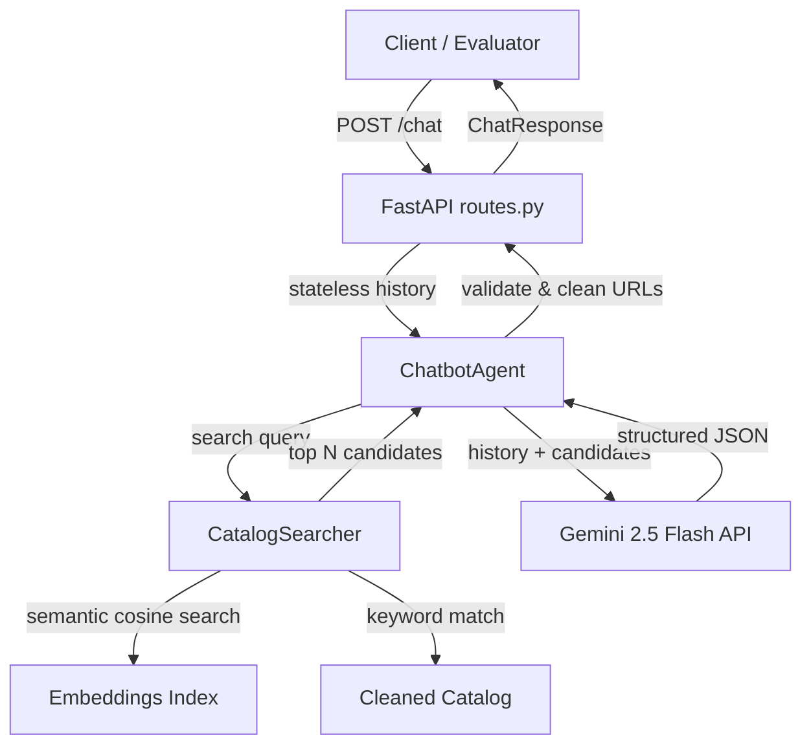

# Conversational SHL Assessment Recommender API

This is a stateless, conversational API built with FastAPI that helps hiring managers find suitable SHL assessments through dialogue. The recommender only suggests SHL Individual Test Solutions (ignoring Job Solutions/bundles) and uses a Retrieval-Augmented Generation (RAG) architecture powered by Gemini and Sentence Transformers.

---

## 🛠️ Setup Instructions

### 1. Clone or Copy Files
Ensure you have the project directory structured as follows:
```
app/
    api/
        __init__.py
        routes.py
    chatbot/
        __init__.py
        agent.py
        prompts.py
    retrieval/
        __init__.py
        search.py
    scraper/
        __init__.py
        parse_catalog.py
    models/
        __init__.py
        schemas.py
    utils/
        __init__.py
        config.py
requirements.txt
README.md
verify_agent.py
shl_product_catalog.json
```

### 2. Install Dependencies
Run the following command to install the required Python packages:
```bash
pip install -r requirements.txt
```

### 3. Configure API Credentials
Create a `.env` file in the root of the project (or in your home directory `~/.env`) and add your Gemini API Key:
```env
GEMINI_API_KEY=your_gemini_api_key_here
```

### 4. Build/Clean the Product Catalog
Run the parser to extract and clean the Individual Test Solutions from the raw catalog:
```bash
python app/scraper/parse_catalog.py
```
This filters out job solutions (items with "Solution" in their name) and generates `app/resources/cleaned_catalog.json`.

---

## 🚀 Running the Application

### Start the FastAPI Dev Server
To run the local server:
```bash
uvicorn app.main:app --reload
```
The server will start at `http://localhost:8000`.

*   **Health Check:** `GET http://localhost:8000/health`
*   **Chat Endpoint:** `POST http://localhost:8000/chat`

### Start the Streamlit Chat UI (Frontend)
To run the interactive Streamlit chat interface:
```bash
streamlit run frontend.py
```
This UI allows you to configure your Gemini API Key directly, chat with the recommender agent, and view recommendations as cards.


---

## 🧪 Running Automated Replay Tests

We have provided an automated replay script `verify_agent.py` that loads the 10 sample conversations, feeds the user messages sequentially to the recommender agent, and verifies:
- API response schema compliance.
- Semantic overlap / recall of recommended tests.
- Safety and scope guardrails (e.g. refusing legal questions).

To execute the verification suite:
```bash
python verify_agent.py
```

---

## 📐 Architecture & Design Decisions



### 1. Catalog Filtering
*   **Target Scope:** The recommender must only recommend **SHL Individual Test Solutions**. Pre-packaged job solutions or bundled solutions are out of scope.
*   **Implementation:** We load the raw catalog and filter out any product containing the word `"Solution"` in its name. We map the `keys` in each product to a standard letter abbreviation (`P`, `A`, `B`, `C`, `D`, `E`, `K`, `S`) sorted according to a priority order (`P > A > B > C > D > E > K > S`).

### 2. Retrieval-Augmented Generation (RAG)
*   **Embeddings Index:** We embed all 370 products using `sentence-transformers/all-MiniLM-L6-v2` and save them to `app/resources/embeddings.npy` on the first build. This eliminates re-encoding overhead on startup or runtime.
*   **Semantic & Keyword Hybrid Search:** For each query, we perform a semantic cosine similarity search (top 30 items) combined with keyword filtering. We merge and de-duplicate the results to get a pool of candidate assessments.
*   **LLM Context Ingestion:** Since the pool is small (top 40 items), we pass the detailed names, descriptions, URLs, test types, and durations of these candidates directly into the LLM system prompt. This guarantees that:
    1. The LLM has the full, accurate description for comparison.
    2. All recommended items and URLs are exact matches from the scraped catalog.

### 3. Agent Flow & Safety
*   **State Management:** The API is completely stateless; the conversation history is passed in each request. The agent parses this history to build the search query and message thread.
*   **Structured Output:** We leverage Gemini's native JSON schema enforcement (`response_schema`) to force the model to output a strict JSON structure matching `ChatResponse` (containing `reply`, `recommendations`, and `end_of_conversation`).
*   **Scope Refusals:** The system prompt explicitly guides the agent to politely refuse general hiring advice, legal questions (e.g. HIPAA compliance), and interview prep, and keep the recommendations empty on those turns.
